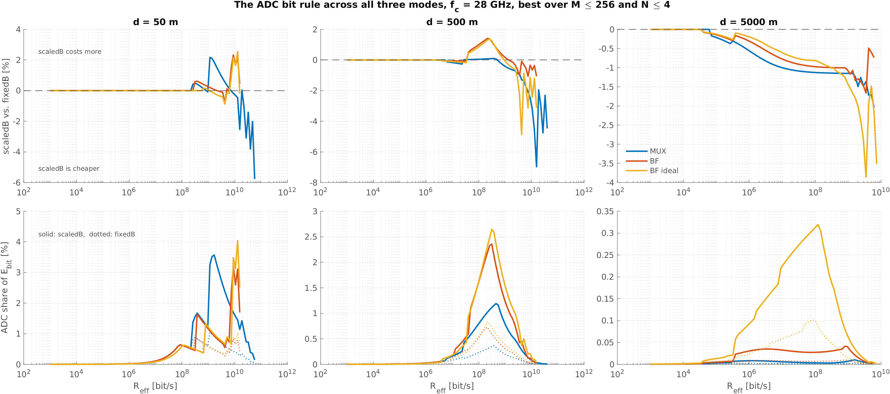

# HPC-Runbook: Beamforming vs. Multiplexing + ADC-Regel

Alles ist als `.m`-Datei vorbereitet, die sich ohne Argumente starten lässt
und ihre Pfade selbst setzt. Die Ressourcen stehen jeweils im Kopfkommentar
(Repo-Konvention, keine Shell-Skripte).

**Keine dieser Dateien ist bisher ausgeführt worden.** Deshalb ist Schritt 0
Pflicht: er prüft in wenigen Minuten alles, was ohne teure Rechnung prüfbar
ist, und bricht laut ab, wenn etwas nicht stimmt.

## Was verglichen wird

| | Multiplexing (MUX) | Beamforming (BF) | BF ideal |
|---|---|---|---|
| Ströme | N | 1 (Eigen-BF, MRT mit `v₁`) | 1 |
| Kanal | i.i.d. Rayleigh, ergodisch | i.i.d. Rayleigh, **dieselbe Ziehung** | AWGN, kein Fading |
| Arraygewinn | — (steckt in N Strömen) | `λ_max(HᴴH)`, zufällig | `N_t·N_r`, deterministisch |
| ADC | je Antenne | je Antenne (digital, Kombination **nach** dem ADC) | wie vor dem ADC kombiniert |
| Hardware | N Ketten je Seite | N Ketten je Seite | N Ketten je Seite |
| SNR-Bezug | Gesamtsendeleistung | Gesamtsendeleistung | Gesamtsendeleistung |

MUX und digitales BF benutzen dieselbe Hardware und unterscheiden sich nur in
der Signalverarbeitung. **BF ideal** ist das bisherige Modell (SISO-Kurve,
voller Gewinn `N_t·N_r`) und dient als Obergrenze: der Abstand zwischen BF
ideal und BF zeigt, was Fading und Quantisierung pro Antenne kosten.

Im Gearbox laufen alle drei im Modus `multiplexing` („eine Kurve je
Antennenkonfiguration"); der Unterschied liegt allein in der Kurve. Beim
idealen BF steckt der Gewinn als Verschiebung der SNR-Achse in der Kurve —
algebraisch identisch zum alten Modus `beamforming`, aber mit einer eigenen
Kurve je N, die scaledB braucht, weil die Bitzahl dort von N abhängt.

**ADC-Regel** (`QuantizedMimoMI/qam/sweep/adcBitsRule.m`):

| | Bits je reeller Dimension |
|---|---|
| fixedB | `½·log₂M + 3` (unabhängig von N) |
| scaledB | `½·log₂M + log₂N + 3` (+1 Bit je Verdopplung) |

Der DAC bleibt in beiden Varianten bei `½·log₂M`.

## Reihenfolge

### Schritt 0 — Validierung (Minuten, kein Pool)

```matlab
cd /workspace/QuantizedMimoMI/qam/validate
validateBfRayleigh                 % MI-Seite, T1–T8

addpath('/workspace/GearboxPHY-MIMO'); setupGearboxPath;
validate_mimo_comparison           % Gearbox-Seite, G1–G4
```

Beide enden mit „alle … bestanden" oder mit einem Fehler. **Nicht weitermachen,
wenn etwas fehlschlägt.** Besonders aussagekräftig:
- **T1** — BF mit N_t = 1 ist bitgenau MUX (Verdrahtung, Zufallsstrom, Präkodierer).
- **T3a** — bestätigt numerisch, dass die MUX-Kurven *je Strom* normiert sind
  (Verhältnis ≈ 2 statt ≈ 1). Das ist der Grund für die SNR-Korrektur.
- **T8** — die exakte AWGN-Kurve des idealen BF stimmt mit der vollen
  Enumeration überein.
- **G1** — Gasts SISO-Ergebnisse bleiben bitgenau.

### Schritt 1 — MI-Kurven (vier unabhängige Jobs, parallel möglich)

| Job | Datei (in `QuantizedMimoMI/qam/sweep/`) | Ausgabe | Ressourcen |
|---|---|---|---|
| MUX fixedB | `runQamSweepBHalf` — **läuft bereits** | `qam/results/bHalf/` | 200 Kerne, 64 GB, 24 h |
| MUX scaledB | `runQamSweepMuxScaledB` | `qam/results/rule_mux/` | 200 Kerne, 64 GB, 24 h |
| BF fixedB+scaledB | `runQamSweepBfRayleigh` | `qam/results/bf_rayleigh/` | 200 Kerne, 64 GB, 12 h |
| BF ideal fixedB+scaledB | `runQamSweepBfIdeal` | `qam/results/bf_ideal/` | **kein Pool, Sekunden** — exakt, keine Mittelung |

Start z. B.:

```matlab
cd /workspace/QuantizedMimoMI/qam/sweep
runQamSweepMuxScaledB
```

Die drei großen Läufe sind unterbrechbar: fertige Konfigurationen werden
beim Neustart übersprungen.

**Speicher im laufenden fixedB-Job** (Abschätzung aus den Array-Formen, nicht
gemessen). Bei 200 Workern auf 64 GB könnten diese Konfigurationen knapp
werden oder abbrechen:

| Konfiguration | Tier | je Worker | × 200 |
|---|---|---|---|
| 2×2, M = 256 | 2 (Hcond-Arrays) | ~270 MB | ~54 GB |
| 8×8, M = 256 | 3 (obere Schranke) | ~262 MB | ~52 GB |
| 16×16, M = 64 | 3 | ~262 MB | ~52 GB |
| 16×16, M = 256 | 3 | ~524 MB | ~105 GB |

Bricht der Job an einer davon ab: mit weniger Workern neu starten, die
fertigen Konfigurationen bleiben erhalten. Die neuen Läufe (scaledB, BF) leiten
Blockgröße und das Abschalten der schweren oberen Schranken selbst aus
150 MB/Worker ab (`runRuleSweep.m`) und haben dieses Problem nicht.

### Schritt 2 — Export in die Gearbox-Datenordner (Minuten)

```matlab
addpath('/workspace/GearboxPHY-MIMO'); setupGearboxPath;
export_mimo_comparison_curves
```

Legt sechs Ordner unter `data/` an: `SE_data_mux_fixedB/_scaledB`, `SE_data_bf_fixedB/_scaledB`
und `SE_data_bfideal_fixedB/_scaledB`. `data/SE_data` selbst bleibt unangetastet.

Zwei Ausgaben prüfen:
1. **Vollständigkeitstabelle** — jede Zelle `NxN B=..`, kein `FEHLT`/`FALSCH`.
2. **Querprüfung 1×1**, getrennt nach Kanal — in den vier Rayleigh-Ordnern
   und in den zwei AWGN-Ordnern jeweils `gleich`. Eine `ABWEICHUNG` heißt,
   dass die Läufe aus Schritt 1 nicht dieselben Einstellungen hatten (Seed,
   nMC, SNR-Raster). Dass sich die 1×1-Kurven *zwischen* Rayleigh und AWGN
   unterscheiden, ist gewollt.

### Vorablauf mit `N ≤ 4` (optional, aber empfohlen)

Schritt 2 bis 4 sind geschrieben, aber **noch nie gelaufen**. Von den 20
`(N, M)`-Kombinationen liegen 14 in allen sechs Varianten vor; vollständig
über alle Ordnungen ist `N ∈ {1, 2, 4}`. `N_LIST` bzw. `CFG.Ns` stehen
deshalb vorerst auf `[1 2 4]`.

Das ist zweierlei: ein vorläufiges Ergebnis und der erste Durchlauf der
ganzen Kette, bevor der vollständige Lauf Clusterzeit verbraucht.

**Was er nicht zeigt:** Bei `N ≤ 4` beträgt der Arraygewinn höchstens
12 dB und die ADC-Regel kostet höchstens 2 Bit. Ob Beamforming bei 16×16
noch gewinnt und ob die Regel Multiplexing dort kippt, bleibt offen — das
sind die eigentlich interessanten Fragen.

Zurückschalten auf `[1 2 4 8 16]`, sobald diese acht Kurven da sind:

| Lauf | fehlt |
|---|---|
| MUX fixedB | `16×16` bei M = 4, 16, 64, 256 · `8×8` bei M = 64, 256 |
| MUX scaledB | `8×8` und `16×16` bei M = 256 |

**Alle Varianten müssen auf derselben Menge laufen.** Ideales Beamforming
ist schon vollständig (20/20); mit `N` bis 16 gewänne es allein durch die
größere Auswahl.

### Schritt 3 — Gearbox-Sweeps

```matlab
run_mimo_comparison_sweep          % 3a: R_eff-Sweep, 6 Varianten x 3 Distanzen
run_mimo_comparison_distance       % 3b: Distanzschnitt bei 1 Mbit/s und 1 Gbit/s
```

| | Ressourcen | Ausgabe |
|---|---|---|
| 3a | 100 Kerne (mehr bringt nichts: 100 Ratenpunkte), 64 GB, 12 h | `results/cmp_<variante>_d<d>/` |
| 3b | 32 Kerne (25 Distanzen), 64 GB, 6 h | `results/cmp_distance_<variante>.mat` |

Beide unterbrechbar bzw. je Variante gespeichert.

### Schritt 4 — Auswertung

```matlab
out = analyze_mimo_comparison();
```

Schreibt nach `results/cmp_figures/`:
- `cmp_ebit.png` — E_bit über R_eff: SISO (schwarz, Rayleigh), bestes MUX (blau),
  bestes BF (rot), bestes BF ideal (gelb); fixedB durchgezogen, scaledB gestrichelt
- `cmp_nopt.png` — energieoptimale Antennenzahl
- `cmp_adc_share.png` — ADC-Anteil im Optimum: was die Regel kostet
- `cmp_distance.png` — Distanzschnitt
- `summary.mat`

Dazu eine Tabelle in der Konsole. Der „beste Modus" dort wird nur unter
den Rayleigh-Modellen bestimmt; BF ideal steht als Obergrenze daneben.

### Schritt 4b — die ADC-Regel für sich

```matlab
analyze_adc_rule_all                 % alle drei Modi in einer Abbildung
analyze_adc_rule(mode="mux")         % je Modus einzeln, mit E_bit-Kurven
```

Die Sechs-Varianten-Abbildungen aus Schritt 4 zeigen `fixedB` und
`scaledB` nebeneinander, aber nicht *gegeneinander*. Dafür ist diese hier:



Oben die Differenz in Prozent, unten der ADC-Anteil am Energiebudget, der
sie erklärt — durchgezogen `scaledB`, gepunktet `fixedB`.

Die absoluten E_bit-Kurven fehlen mit Absicht: In den Einzelabbildungen
liegen beide Regeln sichtbar übereinander. Der Unterschied ist zu klein
für eine logarithmische Achse über acht Dekaden, und genau deshalb ist die
Differenz die Aussage und nicht die Kurve.

| Modus | Punkte | Median | Spanne | `scaledB` günstiger |
|---|---|---|---|---|
| MUX | 277 | +0,00 % | −6,97 … +2,16 % | 43,3 % |
| BF | 265 | +0,00 % | −1,66 … +2,33 % | 40,8 % |
| BF ideal | 266 | +0,00 % | −4,87 … +2,56 % | 45,1 % |

**Das zusätzliche Bit je Antennenverdopplung ist praktisch gratis, und
kein Modus wird davon systematisch begünstigt** — das ist es, was den
Sechs-Varianten-Vergleich fair macht.

Zwei gegenläufige Effekte: Die feinere Quantisierung hebt die SE-Kurve,
dieselbe Rate braucht also weniger Sendeleistung; der Wandler kostet
dagegen 2^b, und davon stehen N_r Stück im Empfänger, unter `scaledB`
wächst die ADC-Leistung also mit N² statt mit N. Welcher gewinnt, hängt
daran, wie groß der ADC-Anteil überhaupt ist — bei 50 m erreicht er unter
`scaledB` 3,1–4,0 %, bei 5 km nur noch 0,3 %, dort entscheidet die bessere
Kurve.

Drei Dinge, die man beim Lesen wissen muss:

- **Die Zacken am rechten Rand** jedes Felds sind Randverhalten, kein
  Regeleffekt. Dort nähern sich die Kurven ihrer Machbarkeitsgrenze, E_bit
  biegt steil nach oben, und ein kleiner Unterschied in der erreichbaren
  Maximalrate schlägt stark aufs Verhältnis durch. Der Extremwert −6,97 %
  liegt genau da.
- **Die gewählte Antennenzahl ändert sich fast nie**: 0 von 277 Punkten
  bei MUX, 2 von 265 bei BF, 2 von 266 bei BF ideal. Die Regel ändert, was
  der Wandler kostet, nicht welches Array der Optimierer wählt.
- **Der ADC-Anteil von BF ideal liegt bei 5 km eine Größenordnung über dem
  von MUX** (0,32 % gegen 0,005 %). Das ist die Modellnaht, nicht Physik:
  Die Kurve von BF ideal kommt aus EINEM Quantisierer auf dem kombinierten
  Signal, bezahlt werden N_r. Von den drei Modi steht dieser Regelvergleich
  als einziger auf dieser Naht.

### Der Rang-1-Endpunkt (K = Inf)

```matlab
cd /workspace/QuantizedMimoMI/qam/sweep
runQamSweepMuxRank1
```

**RESSOURCEN: nodes=1 ntasks=1 cpus-per-task=4 mem=32G time=04:00:00**

Fuellt die rechte Kante der K-Achse fuer Multiplexing. Fuer Beamforming
gab es diesen Endpunkt laengst (`runQamSweepBfIdeal`: SISO-AWGN plus
Gewinn N_t·N_r); fuer MUX fehlte er, und die Rice-Auswertung konnte dort
nur einen der beiden Modi zeigen.

Drei Dinge, die bei diesem Lauf anders sind als bei allen anderen:

- **`nMC = 1`, und das ist korrekt.** Bei K = Inf ist der Kanal
  deterministisch (H = H_LOS, Rang 1). 400 Ziehungen lieferten 400-mal
  dieselbe Matrix. Die Konfidenzintervalle in der Ergebnisdatei sind
  deshalb 0 — es gibt nichts zu streuen.
- **Mehr Kerne bringen nichts.** Parallelisiert wird ueber die
  Realisierungen, und davon gibt es eine. Der Treiber deckelt die
  Workerzahl deshalb bei 4. Der Job wird wegen des SPEICHERS angefordert,
  nicht wegen der Rechenzeit: bei N = 16 und B = 11 faellt Tier 3 an, und
  `miUpperBound` braucht dort rund 8,4 GB.
- **N = 1, 2 und 4 rechnen am Arbeitsplatz in Minuten** und liegen in der
  Regel schon vor. `runRuleSweep` ueberspringt vorhandene Dateien, der
  Clusterlauf holt also nur N = 8 und 16 nach. Vorher nichts loeschen.

Pruefung des Ergebnisses: Bei Rang 1 sieht jede Empfangsantenne nur die
SUMME der Sendesymbole, mehr als `log2(#verschiedene Summen)` ist also
nicht uebertragbar — 4,64 statt 8 bit bei 4x4 QPSK, 7,40 statt 16 bei
4x4 16-QAM. **Eine Kurve ueber dieser Decke ist falsch.**

Danach `K_RICE` in `export_mimo_comparison_curves.m` um `Inf` ergaenzen,
damit die Variante `mux_scaledB_KInf` exportiert wird.

### Schritt 4c — der Rice-Sweep

```matlab
analyze_rice_comparison
```

Schreibt `cmp_rice.png`: E_bit über dem Rice-Faktor K, darunter das
Verhältnis BF/MUX mit dem Schnittpunkt K*. Siehe `RICE_EXTENSION_PLAN.md`
und den Abschnitt „Grenzen" weiter unten.

**Schritt 4 läuft auch ohne 3a.** Fehlen die `results/cmp_*_d<d>/`-Ordner,
entsteht nur `cmp_distance.png` — mit einer Warnung, nicht mit einem
Abbruch. Das ist der Normalfall am Arbeitsplatz: 3b ist dort in rund
10 Minuten seriell fertig, 3a braucht den Cluster. Umgekehrt ist 3b
schon immer optional.

Die Antennenachse von `cmp_distance.png` kommt aus `CFG.Ns` **der
Ergebnisdatei**, nicht aus `opts.Ns`. Solange 3b auf `[1 2 4]`
beschränkt ist, zeigt die Abbildung also genau das — ohne dass man
`opts.Ns` mitpflegen muss.

### Schritt 4d — die dritte ADC-Regel (`alphabetB`), zwei parallele Treiber

```matlab
cd /workspace/QuantizedMimoMI/qam/sweep
runQamSweepAlphabet1        % Allokation A
runQamSweepAlphabet2        % Allokation B, gleichzeitig
```

**RESSOURCEN je Treiber: nodes=1 ntasks=1 cpus-per-task=200 mem=64G
time=24:00:00** — Teil 1 rund 16 h, Teil 2 rund 18 h.

Die Regel ist `B = N_t·½log₂M + 3`: sie bezahlt die Überlagerung am
Empfänger vollständig, denn je reeller Achse überlagern sich `N_t` mal
`√M` Stufen. Sie wächst damit **linear** in `N_t`, wo `scaledB`
logarithmisch wächst und `fixedB` gar nicht — die drei Regeln klammern den
Entwurfsraum also von unten (`fixedB`), in der Mitte (`scaledB`) und von
oben (`alphabetB`).

**Nur Multiplexing.** Bei Beamforming kommt EIN Strom an, das beobachtete
Alphabet ist `M` unabhängig von `N_t`, und `alphabetB` wäre dort mit
`fixedB` identisch. Ein BF-Lauf brauchte es nicht.

Das Gitter ist kleiner als bei den anderen Regeln, weil `L = 2^B` in jeder
Zwischenrechnung steckt und nur `B ≤ 20` rechenbar ist (`adcBitsRule`
bricht über 30 ab und warnt über 20). Die Bitzahl je Konfiguration:

| | N=1 | 2 | 4 | 8 | 16 |
|---|---|---|---|---|---|
| M=4 | 4 | 5 | 7 | 11 | 19 |
| M=16 | 5 | 7 | 11 | 19 | — |
| M=64 | 6 | 9 | 15 | — | — |
| M=256 | 7 | 11 | 19 | — | — |

`—` heißt „über der Grenze, nicht im Gitter" — die Regel liefert dort
durchaus Werte (27, 35, 51, 67), nur keine rechenbaren.

**Die Aufteilung ist gemessen, nicht geschätzt** (`alphabetGrid.m`, eine
Quelle für beide Treiber — `validateAlphabetGrid` prüft Abdeckung,
Eindeutigkeit, `B ≤ 20` und die Balance). Die Kosten stammen aus den
vorhandenen `scaledB`-Läufen derselben Konfigurationen, umgerechnet auf
Kernsekunden je Realisierung; verteilt wird nach Longest Processing Time.
Ergebnis 1388 s gegen 1522 s, also 8,8 % Schieflage. **Mehr Ausgewogenheit
ist nicht erreichbar**: `N_t=8/M=4` trägt allein 1320 s und damit 45 % der
Summe — ein unteilbares Stück, das die Grenze setzt.

Zwei Dinge, die man vor dem Start wissen muss:

- **Eine angefangene Kurve geht nicht mehr verloren.** `runRuleSweep`
  schreibt seit dem Checkpoint je SNR-Punkt nach jedem Punkt in
  `results/rule_mux/checkpoints/` und setzt beim Neustart am nächsten Punkt
  fort (Meldung: „Checkpoint: n von N Punkten liegen vor"). Vorher war eine
  Kurve ein Alles-oder-nichts-Lauf, und bei `N_t=8/M=4` sind das 15,4 h
  gegen ein 24-h-Fenster. Beim Neustart **nichts löschen**, auch nicht den
  Checkpoint-Ordner. Der Checkpoint führt alle Parameter mit, die die Kurve
  bestimmen; passen sie nicht, verwirft er sich selbst mit einer Warnung
  (`runRuleSweep:cpStale`) statt still auf fremdem Zwischenstand
  aufzusetzen.
- **Ein Teil des Gitters liegt schon vor und wird übersprungen.** Für
  `N_t=1` (alle M) und `N_t=2/M=4` liefert `alphabetB` dieselbe Bitzahl wie
  `scaledB`, und gleiches `B` heißt dieselbe Kurve. Das ist richtig, kein
  fehlender Lauf.

Danach, für die Auswertung: in `export_mimo_comparison_curves.m` die
Variantenliste `V` um einen Eintrag `mux_alphabetB` (`srcDir` `rule_mux`,
`variant` `"alphabetB"`) ergänzen. Erst dann sieht die Gearbox-Seite die
dritte Regel.

## Was sich am Code geändert hat

### Zwei Korrekturen am Energiemodell (betreffen alle MUX-Ergebnisse)

1. **ADC-Leistung passt jetzt zur Kurve.** `qamGear`/`naQamGear` haben den ADC
   bisher immer mit `½·log₂M` Bit bezahlt, auch für Kurven, die mit feinerem
   ADC gerechnet waren. Jetzt wird die Auflösung aus dem Feld `sourceB` der
   Kurvendatei bezahlt. Der DAC ist davon getrennt und bleibt bei `½·log₂M`.
   Ohne `sourceB` (Gasts SISO-Kurven) ändert sich nichts.
2. **SNR-Normierung.** `QuantizedMimoMI` rechnet mit `Es = 1` je Strom, das
   Gearbox mit Gesamtleistung. Multiplexing bekam dadurch 10·log₁₀(N_t) dB
   geschenkt (3/6/9/12 dB bei 2×2 … 16×16). Der Export rechnet jetzt um und
   schreibt `snrReference = 'total'`; `loadSECurve` weist Mehrstrom-Kurven
   ohne dieses Feld ab.

**Folge:** Die bisherigen Multiplexing-Ergebnisse in `results/` (und damit
die MUX-Zahlen der Folien 36–38 vom Gruppentreffen) sind mit beiden Fehlern
gerechnet und zu optimistisch für MUX. `run_sweep.m` im Multiplexing-Modus
mit `SE_data` bricht jetzt absichtlich ab, und `mimo_smoke_test.m` läuft auf
`SE_data_mux_fixedB`.

### Dritte Korrektur: `trimCurve` liefert jetzt streng monotone Kurven

`snrLookup` interpoliert **invers** — `interp1(SE_vec, SNR_vec, SE)` —, die
SE-Werte sind also die Stützstellen, und `interp1` lehnt sie ab, sobald ein
Wert doppelt vorkommt („Sample points must be unique"). `trimCurve` schnitt
bisher nur beim ersten Maximum ab. Das genügt nicht:

- **Exakt gerechnete Kurven** (`miSisoAwgnQuant`, ideales BF) erreichen ihr
  Plateau in doppelter Genauigkeit *vor* dem Maximum: mehrere Werte sind
  bitgleich, ein späterer ist um ~1e-15 größer. Das Maximum liegt hinter
  dem Plateau, das Plateau überlebt den Schnitt — `interp1` stürzt ab.
  Genau daran scheiterte Schritt 3b bei `bfideal_fixedB`.
- **MC-Kurven** haben keine exakten Plateaus, aber **Dellen**. Ein Filter
  gegen den unmittelbaren Vorgänger (`diff > 0`) reicht dafür nicht: in der
  Folge 5, 4, 5 fällt die 4 weg, die zweite 5 gilt gegenüber der 4 als
  Anstieg und landet neben der ersten 5 — wieder ein Duplikat.

`trimCurve` vergleicht jetzt gegen das **Laufmaximum der bereits behaltenen**
Punkte. Das Ergebnis ist per Konstruktion streng monoton, für jede Eingabe;
Plateau und Delle fallen in einem Durchgang weg. Von einem Plateau bleibt
der *erste* Punkt, also die niedrigste SNR, bei der die SE erreicht wird.

Geprüft über alle 160 vorhandenen Kurven: 0 nicht monoton. An Gasts
QAM-Referenzkurven ändert sich **nichts** (bitgleich). Die einzige
betroffene Referenzkurve ist `SE_MTX_1_ZXM.mat`: sie hat bei 14 dB eine
Delle von −6.4e-5, deren Punkt nun wegfällt (39 → 38 Punkte). Die alte
Fassung stürzte daran nicht ab, weil alle Werte eindeutig waren;
`snrLookup` weicht dadurch um **unter 5e-5 dB** ab.

### Neue und geänderte Dateien (zum Übertragen aufs HPC)

`QuantizedMimoMI/`

| Datei | |
|---|---|
| `qam/core/ergodicMiBeamforming.m` | neu — digitales Eigen-BF, Rayleigh, ADC je Antenne |
| `qam/core/allBounds.m` | Schalter `heavyUpper` (Default unverändert) |
| `qam/sweep/adcBitsRule.m` | neu — die Bitregel, eine Quelle für alle Läufe |
| `qam/sweep/mldChunkRows.m` | neu — Tier-2-Blockgröße aus Speicherbudget |
| `qam/sweep/runRuleSweep.m` | neu — Sweep für MUX und BF, `B` im Dateinamen |
| `qam/sweep/runQamSweepMuxScaledB.m` | neu — Treiber MUX scaledB |
| `qam/sweep/runQamSweepBfRayleigh.m` | neu — Treiber BF fixedB+scaledB |
| `qam/core/miSisoAwgnQuant.m` | neu — exakte AWGN-SISO-Kurve (ideales BF) |
| `qam/sweep/runQamSweepBfIdeal.m` | neu — Treiber BF ideal fixedB+scaledB |
| `qam/sweep/exportToGearboxSEData.m` | SNR-Umrechnung, Varianten, Basisordner, 1×1 als SISO |
| `qam/validate/validateBfRayleigh.m` | neu — Schritt 0, MI-Seite |
| `qam/sweep/runRuleSweep.m` | Checkpoint je SNR-Punkt, Signatur gegen Fremdstand |
| `qam/sweep/alphabetGrid.m` | neu — Gitter + gemessene Aufteilung des `alphabetB`-Sweeps |
| `qam/sweep/runQamSweepAlphabet1.m` | neu — Treiber MUX `alphabetB`, Teil 1 von 2 |
| `qam/sweep/runQamSweepAlphabet2.m` | neu — Treiber MUX `alphabetB`, Teil 2 von 2 |
| `qam/validate/validateAlphabetGrid.m` | neu — Abdeckung, `B ≤ 20`, Regel, Balance |
| `qam/sweep/runQamSweepMuxRank1.m` | neu — Rang-1-Endpunkt (K = Inf), `nMC = 1` |
| `qam/core/riceChannel.m` | nimmt `K = Inf` (reines LOS, Rang 1) |
| `qam/sweep/migrateVariantNames.m` | neu — Etiketten V0/V1 → `fixedB`/`scaledB` in alten `.mat` |

`GearboxPHY-MIMO/`

| Datei | |
|---|---|
| `+gearboxphy/+data/loadSECurve.m` | liest `sourceB`/`snrReference`, Schutz |
| `+gearboxphy/+gears/qamGear.m` | ADC/DAC getrennt, ADC aus `sourceB` |
| `+gearboxphy/+gears/naQamGear.m` | dito |
| `studies/mimo_comparison/validate_mimo_comparison.m` | neu — Schritt 0, Gearbox-Seite |
| `studies/mimo_comparison/export_mimo_comparison_curves.m` | neu — Schritt 2 |
| `studies/mimo_comparison/run_mimo_comparison_sweep.m` | neu — Schritt 3a |
| `studies/mimo_comparison/run_mimo_comparison_distance.m` | neu — Schritt 3b |
| `studies/mimo_comparison/analyze_mimo_comparison.m` | neu — Schritt 4, läuft auch ohne 3a |
| `+gearboxphy/+optimize/trimCurve.m` | streng monoton per Laufmaximum |
| `+gearboxphy/+paths/` | neu — Wurzel/`data`/`results`, eine Pfadquelle |
| `setupGearboxPath.m` | neu — legt `studies/` und `tests/` auf den Pfad |
| `tests/mimo_smoke_test.m` | läuft auf `SE_data_mux_fixedB`, Physik-Assertion entschärft |

`migrateVariantNames` ist **keine Voraussetzung für den Export** — das war
eine falsche Annahme und ist nachgeprüft: `exportToGearboxSEData` wählt die
Dateien über `B` gegen `adcBitsRule(M, N_t, N_r, variant)` aus, nicht über
das Feld `results.variants`, und dieses Feld liest überhaupt nichts weiter.
Alte Kurven mit dem Etikett `V0`/`V1` exportieren also korrekt. Das Skript
räumt nur die Metadaten auf, damit eine Ergebnisdatei die Regel benennt, mit
der sie gerechnet wurde.

**Das Repo ist umstrukturiert** (2026-10-02): `gearboxphy_framework/` ist
aufgeloest, der Framework-Ordner IST das Repo. Skripte liegen nach Studie in
`studies/<name>/`, Kurven in `data/`, Ergebnisse in `results/` (ohne das
frühere Praefix `results_`), Doku in `docs/`. Beim Abgleich mit dem HPC
deshalb den ganzen Baum uebertragen, nicht einzelne Dateien.

Der laufende fixedB-Job ist von keiner dieser Änderungen betroffen, auch nicht,
wenn die Dateien während des Laufs synchronisiert werden: `allBounds` rechnet
mit dem Default exakt wie vorher, in derselben Zufallsstrom-Reihenfolge, und
alle anderen Änderungen liegen in Dateien, die der Job nicht aufruft.

## Grenzen, die in die Auswertung gehören

- **Das Kanalmodell entscheidet das Ergebnis mit — und begünstigt MUX.**
  Der Vergleich MUX↔BF ist methodisch sauber: beide laufen im
  i.i.d.-Rayleigh-Kanal, auf **denselben Realisierungen** (gleicher
  Threefry-Strom, also gepaart), mit demselben Hardwaremodell und derselben
  ADC-Regel. Digitales Eigen-Beamforming braucht **kein** LOS; es nutzt den
  stärksten Eigenmodus der jeweiligen Realisierung, der Gewinn ist
  E[λ_max].

  Aber i.i.d. Rayleigh ist der **günstigste Fall für Multiplexing**: der
  Kanal ist mit Wahrscheinlichkeit 1 vollrangig, alle N Eigenmodi tragen.
  MUX' gesamter Vorsprung bei hohen Raten ist ein *Raten*vorteil aus N
  parallelen Strömen. Bei Rang 1 verschwindet er vollständig — dann gibt
  es nur einen nutzbaren Eigenmodus, und MUX fällt auf BF zurück.
  Umgekehrt zahlt BF bei Rayleigh drauf: E[λ_max] bleibt 2,2 dB (4×4)
  bzw. 6,8 dB (16×16) hinter N_t·N_r zurück.

  **Bei 28 GHz ist das die schwächste Annahme der Studie.** mmWave-Kanäle
  sind dünn besetzt, oft von wenigen Pfaden oder einer Sichtverbindung
  dominiert, mit entsprechend begrenztem Rang. Jede Aussage der Form
  „MUX gewinnt bei hohen Raten" gilt derzeit für genau den Kanal, der bei
  dieser Trägerfrequenz am seltensten vorliegt. Aufzulösen durch den
  Rice-Sweep, siehe `RICE_EXTENSION_PLAN.md`.
- **Ideales BF idealisiert den KANAL, nicht die Wandler.** Der Abstand
  rot↔gelb ist ein reiner Kanaleffekt (Rang-1 statt Rayleigh). Die
  frühere Lesart „Kombination vor dem ADC sei ein Vorteil" ist falsch:
  nachgerechnet über einen Rang-1-LOS-Kanal bei gleicher Bitzahl ist
  digitales Quantisieren je Antenne mit anschließendem Kombinieren
  **besser** als ein Wandler auf dem kombinierten Signal (+0,09 bit bei
  M=16, B=4, N_r=3; +0,018 bei B=5; bei N_r=1 identisch). Grund: die
  Aussteuerung je Antenne hängt am kleinen Elementsignal, und die N_r
  unabhängigen Quantisierungsfehler mitteln sich beim kohärenten
  Kombinieren heraus. Die ideale Kurve ist dadurch leicht **pessimistisch**
  — konservativ, also unschädlich. `N_r` volle Ketten im Budget sind für
  eine digitale Umsetzung korrekt.
- **Der Rice-Sweep misst Rangarmut, nicht Sichtverbindung.** `H_LOS` ist
  Broadside mit λ/2-Abstand, also der vollständig korrelierte Grenzfall.
  Rang 1 folgt aus dieser **Geometrie**, nicht aus LOS: bei passendem
  Antennenabstand (LOS-MIMO, grob `d_t·d_r ≈ λ·R/N`) ist auch ein reiner
  Sichtverbindungskanal vollrangig, und Multiplexing funktioniert dort
  ungeschmälert. „LOS tötet Multiplexing" wäre also falsch; richtig ist
  „ein rangarmer Kanal tötet Multiplexing". Bei 28 GHz mit kompakten
  Arrays auf größere Distanz ist der Kanal typischerweise rangarm — das
  ist der Grund, warum der Sweep überhaupt etwas zeigt, und es gehört in
  jede daraus abgeleitete Aussage. Herleitung und Zahlen in
  `docs/RICE_EXTENSION_PLAN.md`, Abschnitt „Was K wirklich misst".
- **Beim Rice-Sweep nicht auf den Sättigungswert schauen.** Bei K = 30
  erreicht MUX 4×4 QPSK immer noch 7,997 von 8 bit: ein Zweiunddreißigstel
  der Leistung steckt noch im NLOS-Anteil, und bei 25 dB sättigen auch die
  schwachen Moden. Der Verlust zeigt sich als **SNR-Verschiebung** (bis
  +8,42 dB gemessen), nicht als niedrigere Decke. Wer die Kurven über die
  Sättigung vergleicht, hält den Effekt für abwesend.
- **ADC-Leistungsmodell bei hohen Bitzahlen.** `P_ADC ∝ 2^b` (Walden) gilt
  bis etwa 10 effektive Bit; darüber ist ein Faktor 4 je Bit üblich. scaledB geht
  bis 11 Bit — das Modell ist dort optimistisch.
- **CSI — die Verzerrung zugunsten von BF.** Beamforming setzt perfekte
  Kanalkenntnis am Sender voraus (für `v₁`), Multiplexing kommt mit
  Kenntnis am Empfänger aus. Das ist nicht nur eine Annahme, sondern eine
  **gerichtete Verzerrung**, und sie ist im Energiemodell nicht bepreist:
  der Rückkanal kostet hier nichts.

  Dass sie MUX benachteiligt, lässt sich ohne Simulation zeigen: Die
  Einheitsmatrix liegt in der Menge der zulässigen Präkodierer. Ein
  CSIT-fähiges Multiplexing, das über alle `F` optimiert, ist also
  **mindestens so gut** wie das heutige Open-Loop-MUX mit `F = I`. Die
  ausgewiesene MUX-Zahl ist damit eine *untere* Schranke.

  Wie viel Struktur dabei ungenutzt bleibt, zeigen die mittleren
  Eigenwerte von `HᴴH` bei i.i.d. Rayleigh:

  | N | E[λᵢ], absteigend | λ₁/λ_N |
  |---|---|---|
  | 2 | 3,52 · 0,50 | 7 |
  | 4 | 9,74 · 4,39 · 1,56 · 0,25 | 39 |

  Bei Gleichverteilung bekommt der schwächste Modus denselben
  Leistungsanteil wie der stärkste, obwohl er 39-mal schwächer ist.

  **Strukturell** ist Beamforming der Einstrom-Sonderfall optimaler
  CSIT-Übertragung: Bei niedriger SNR legt Water-Filling alles auf den
  stärksten Modus, und das *ist* MRT. Verglichen wird derzeit also „1
  Strom mit CSIT" gegen „N Ströme ohne CSIT"; die Mitte — *k* Ströme mit
  CSIT — fehlt, und genau dort läge die Antwort auf „wie viele Ströme
  lohnen sich".

  **Richtung gegenüber der Kanalverzerrung:** Diese hier begünstigt BF,
  die Kanalannahme (i.i.d. Rayleigh) begünstigt MUX. Sie laufen
  gegeneinander, heben sich aber nicht nachweislich auf — beide sind
  unkontrolliert.

  **Unberührt davon ist der ADC-Regelvergleich**: dort wird jeder Modus
  mit sich selbst verglichen (`fixedB` gegen `scaledB`), CSIT kürzt sich
  heraus.

  Aufzulösen durch ein präkodiertes Multiplexing, siehe
  `PRECODED_MUX_EXTENSION_PLAN.md`.
- **Phasenkonvention von `v₁`.** Mit Quantisierung hängt die MI von der Phase
  des Präkodierers ab. Sie ist fest gewählt (erstes Element reell positiv),
  nicht auf MI optimiert.
- **SNR-Raster der Rayleigh-Läufe endet bei 25 dB.** 256-QAM sättigt dort
  möglicherweise noch nicht; die Kurven wären dann am oberen Ende abgeschnitten,
  und die Spitzenrate eines Modus hinge am Raster statt am Verfahren. Der
  Export druckt je Kurve `max SE` gegen die Obergrenze — dort nachsehen. Das
  ideale BF nutzt -20…45 dB (kostet nichts) und ist davon nicht betroffen.
- **Unterschiedliche SNR-Raster der Läufe.** Beamforming wurde mit 1 dB
  gerechnet, Multiplexing scaledB mit 2 dB (weil fixedB so teuer war). Der Gearbox
  interpoliert ohnehin, das ist also kein Struktur-, sondern ein
  Genauigkeitsunterschied: gemessen bis zu **0,23 dB** im nötigen SNR,
  im Median 0,01 dB. Schritt 2 dünnt deshalb **alle** Rayleigh-Kurven auf
  `-15:2:25` aus, damit der Unterschied nicht einseitig eine Seite des
  Vergleichs trifft. `-15:2:25` ist Teilmenge von `-15:1:25`, es wird also
  exakt ausgewählt und nichts interpoliert. Ideales Beamforming behält
  sein feineres Raster: exakt gerechnet, weiterer Bereich, und nur eine
  Obergrenze.
- **Nur QAM mit M ≤ 256 im Vergleich — und die anderen Gänge gewinnen.**
  Von den 44 Kurven je Datenordner sind 20 unsere (Rayleigh, K = 0, mit
  unserem ADC-Modell) und **24 Framework-Originale**: ZXM, Pulse/IR,
  NA-QAM, QAM M = 1024/4096. Die sind AWGN, ohne Fading, und nicht mit
  unserem Quantisierungsmodell gerechnet. `analyze_mimo_comparison`
  (und `analyze_siso_vs_mimo`) lesen deshalb ausschließlich
  `qam_M<M>_fc28GHz.mat` mit M ≤ 256 — der Vergleich steht QAM gegen QAM,
  gleicher Kanal, gleiche Quantisierung.

  Zu sagen, sie „laufen mit, werden aber nicht ausgewertet“, ist jedoch zu
  harmlos. Gemessen am besten QAM derselben Läufe schlagen sie es über
  weite Ratenbänder:

  | d | AWGN-Gang schlägt bestes QAM bis | an der obersten Stelle |
  |---|---|---|
  | 50 m | **2,6·10⁸ bit/s** (68 von 91 Punkten) | `zxm_M2` 1,31·10⁻¹⁰ gegen 1,35·10⁻¹⁰ |
  | 500 m | 1,42·10⁶ bit/s (40 von 89) | `pulsearbitrary` 1,51·10⁻⁸ gegen 1,54·10⁻⁸ |
  | 5000 m | 1,35·10⁴ bit/s (15 von 78) | `pulsearbitrary` 1,53·10⁻⁶ gegen 1,57·10⁻⁶ |

  Alle diese Gänge sind **SISO-only**. Sie würden also die SISO-Seite
  stärken, und zwar unzulässig stark, weil ohne Fading — der Ausschluss
  ist richtig, aber er hat einen Preis: **unterhalb dieser Raten ist die
  Auswertung keine Gearbox-Entscheidung mehr.** Dort hätte der Gearbox
  einen anderen Gang gewählt, und die QAM-Zahl beschreibt einen Gang, den
  er verworfen hätte.

  Konkret für SISO gegen MIMO: die Umschlagpunkte (2,4·10⁸ / 5,7·10⁶ /
  6,6·10⁴ bit/s bei 50 / 500 / 5000 m) sind QAM-interne Aussagen. Bei 500
  und 5000 m liegen sie oberhalb des AWGN-Bandes. Bei **50 m liegt der
  Umschlag INNERHALB** (2,4·10⁸ gegen ein Band bis 2,6·10⁸) — dieses
  Panel ist das am wenigsten aussagekräftige der drei.

  Aufzulösen wäre das nur mit Rayleigh-MIMO-Kurven für ZXM und IR. Die
  MI-Frameworks dafür liegen in `QuantizedMimoMI/zxm/` und `ir/`, SE-Kurven
  sind nie exportiert worden; das ist ein eigener Clusterlauf, kein
  Auswertungsschritt.
